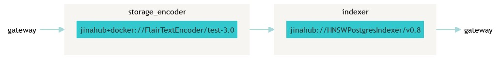

# Querying While Indexing in the Wikipedia Search Example

| About this example: |  |
| ------------- | ------------- |
| Learnings | How to configure Jina for querying while indexing |
| Used for indexing | Text data |
| Used for querying | Text data |
| Dataset used | [Wikipedia dataset from kaggle](https://www.kaggle.com/mikeortman/wikipedia-sentences) |
| Model used | [flair-text](https://github.com/flairNLP/flair) |

This is an example of using [Jina](http://www.jina.ai) to support both querying and indexing simultaneously in our [Wikipedia sentence search example](https://github.com/jina-ai/examples/tree/master/wikipedia-sentences).

## Table of contents:

  * [Prerequisites](#prerequisites)
  * [What is querying while indexing?](#what-is-querying-while-indexing)
  * [Configuration changes](#configuration-changes)
  * [🐍 Build the app with Python](#-build-the-app-with-python)
  * [Flow diagrams](#flow-diagrams)
  * [🔮 Overview of the files](#-overview-of-the-files)
  * [Troubleshooting](#troubleshooting)
  * [⏭️ Next steps](#-next-steps)
  * [👩‍👩‍👧‍👦 Community](#-community)
  * [🦄 License](#-license)

## Prerequisites

- Run and understand the basic **Wikipedia sentence search example**

## What is querying while indexing?

Querying while indexing means you are able to still query your data while new data is simultaneously being inserted (or updated, or deleted).
Jina achieves this with its HNSWPostgreSQL Indexer.

## HNSWPostgreSQL

This is a compound Indexer, made up of a HNSW index, for storing the embeddings, and a PostgreSQL database, for storing the metadata of the documents.
It does not require that you start and stop the storage and query flows to perform the respective operations.
Users can index and search their data during the same flow lifecycle.
You can even configure it to automatically synchronize data from PostgreSQL into the HNSW index.

You can read more about it on the Jina Hub page [here](https://hub.jina.ai/executor/dvp0845a).

_____

## 🐍 Build the app with Python

These instructions explain how to run the example yourself and deploy it with Python.

### 🗝️ Requirements

1. Have a working Python 3.7 or 3.8 environment.
1. We recommend creating a [new Python virtual environment](https://docs.python.org/3/tutorial/venv.html) to have a clean installation of Jina and prevent dependency conflicts.
1. Have at least 5 GB of free space on your hard drive.


### Running the example

### 👾 Step 1. Clone the repo and install Jina

Begin by cloning the repo so you can get the required files and datasets.

```sh
git clone https://github.com/PacktPublishing/JINA-Framework-Full-Stack-Neural-Search-in-Production
cd https://github.com/PacktPublishing/JINA-Framework-Full-Stack-Neural-Search-in-Production/src/Chapter07/cross-modal-searchwikipedia-sentences-query-while-indexing
```

Let's install `jina` and the other required libraries. For further information on installing jina check out [our documentation](https://docs.jina.ai/get-started/install/).

```sh
pip install -r requirements.txt
```

In order to run the example you will need to do the following:

### 📥 Step 2. Download your data to search (Optional)

The repo includes a small subset of the Wikipedia dataset, for quick testing. You can just use that.

If you want to use the entire dataset, run `bash get_data.sh` and then modify the `DATA_FILE` constant (in `app.py`) to point to that file.

### 🏃 Step 3. Running the Flow

Run `python app.py -t flow`

This will create the Flow, and then repeatedly do the following (which can also be done in any other REST client), every 10 seconds:

1. Index 5 Documents.
2. Wait for 10 seconds
3. In parallel, the Indexer transfers the data from the PostgreSQL database to the HNSW index.

### 🔎 Step 4: Query your data

Finally, in a second terminal, run `python app.py -t client`

This will prompt you for a query, send the query to the Query Flow, and then show you the results.

Since the Flows uses `http` protocol, you can query the REST API with whatever `Client` provided within jina or use `cURL`, `Postman` or [custom Swagger UI provided with jina](https://docs.jina.ai/fundamentals/practice-your-learning/#query-via-swaggerui) etc.

## Flow diagrams

Below you can see a graphical representation of the Flow pipeline:



## ⏭️ Next steps

Did you like this example and are you interested in building your own? For a detailed tutorial on how to build your Jina app check out [How to Build Your First Jina App](https://docs.jina.ai/chapters/my_first_jina_app/#how-to-build-your-first-jina-app) guide in our documentation.

If you have any issues following this guide, you can always get support from our [Slack community](https://slack.jina.ai) .

## 👩‍👩‍👧‍👦 Community

- [Slack channel](https://slack.jina.ai) - a communication platform for developers to discuss Jina.
- [LinkedIn](https://www.linkedin.com/company/jinaai/) - get to know Jina AI as a company and find job opportunities.
- [](https://twitter.com/JinaAI_) - follow us and interact with us using hashtag `#JinaSearch`.
- [Company](https://jina.ai) - know more about our company. We are fully committed to open-source!

## 🦄 License

Copyright (c) 2021 Jina AI Limited. All rights reserved.

Jina is licensed under the Apache License, Version 2.0. See LICENSE for the full license text.
